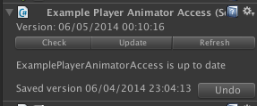

# AnimatorWrapper

Code generator utility for Unity game engine. Creates a class to conveniently access [Animator](http://docs.unity3d.com/ScriptReference/Animator.html) 
states and parameters and detect inconsistencies at compile time. 

## Quick Start
### Installation:
-   Copy all files to some location under your Assets directory but NOT under an EDITOR DIRECTORY.

### Generating Code:
-  In the hierachy view select a game object that contains an Animator component having a valid controller
-  Go to the new menu item Tools / Animator Access / Create Animator Access
-  Select a file name and the output directory where to place the C# file (has to be under Assets directory)
-  Say _Yes_ when the dialog appears about adding the component to the game object.

### Usage example (related to provided ExampleScene.unity):
-   Generated class is **ExamplePlayerAnimatorAccess.cs** in **_InstallDirectory_/AnimatorAccess/Example/Scripts/Generated/ExamplePlayerAnimatorAccess.cs**
-   Game object is **ExamplePlayer**
-   Another component **Player** controls animation related stuff in its FixedUpdate method
-   Animator states are:
  -   **Idle**, **Jumping**, **Walking** and **Yawning** in layer 0 (**Base Layer**)
  -   **Centered**, **Rotate-Left** and **Rotate-Right** in layer 1 (**PlayerRotation**)
-   Animator parameters are:
 -   **JumpTrigger** (trigger) and 
 -   **YawnTrigger** (trigger) and 
 -   **Rotate** (int) and 
 -   **Speed** (float)

To use it define a member in **Player.cs**:
	<pre><code>AnimatorAccess.ExamplePlayerAnimatorAccess anim;</code></pre>
and assign a reference in Awake ():
	<pre><code>anim = GetComponent < AnimatorAccess.ExamplePlayerAnimatorAccess > ();</code></pre>
	
		
Now you have convenient access to all parameters and animator states. Aside from using parameter and state hash IDs 
directly, there are predefined methods for querying the state (prefix **Is**) and **Get** and **Set** methods to access 
parameters in a type safe way:<pre><code>
	void FixedUpdate () {
		currentState0 = animator.GetCurrentAnimatorStateInfo (0).nameHash;
		if (anim.**IsWalking** (currentState0)) {
		...
		anim.**SetSpeed** (Mathf.Abs (speed));
</code></pre>

## Workflow
Whenever you have made any changes in the Animator window like adding, renaming or deleting states or parameters, 
you should update the animator access component. Animator Access Generator analyses the existing version of the
component to be generated and works with a **two-step** procedure to handle changes:

-   Previously valid members (i.e. Animator parameters and states) are detected and marked with the _Obsolete_ attribute
-   Those members in the previous version that are already marked as _Obsolete_ will be renmoved

The basic idea is to give you the chance to refactor your code without having uncompileable code. If there are any 
refrences to members that are not valid any longer, obsolete warnings guide you where you have to make changes:
 
(_CS0168: Animator state or parameter is no longer valid and will be removed in the next code generation..._) .

### Custom Editor
The generated component has a custom inspector window:

The status is updated every 30 seconds automatically. Use the _Check_ button to force a status update. _Check_ will 
not perform any changes but is meant to preview what will happen on an update. 

The _Update_ button will regenerate the component's source code. 

Advanced Topics
===============
If you modify, add or remove states or parameters in the animator view you should regenerate your wrapper class.
To do so just repeat the steps decribed above. When a wrapper class is recreated, the generator performs some 
basic code analysis to help you migrating your code. If for example properties are no longer valid, a warning 
shows up so you can decide to cancel the generation. Especially in the case of renaming states or parameters it 
might be more efficient to do some refactoring in the IDE before regenerating the code. Thus you don't have to
fix a bunch of compiler warnings afterwards.

Layer names are prepended by default for all layers above the first one i.e. first layer members don't have the 
layer prefix but all higher levels do so. If you had only one layer and add another one let's call it 'Layer2', 
all your existing state checking methods like 'IsIdle' from layer 1 stay with the same name. Starting with 
Layer2 the prefix will be set e.g. 'IsLayer2Shooting'. 
