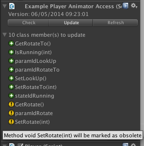
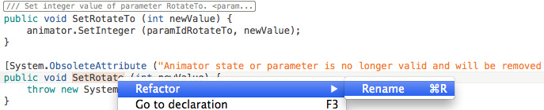

# Animator Access Generator

Code generator utility for Unity game engine. Creates a class to conveniently access [Animator](http://docs.unity3d.com/ScriptReference/Animator.html) 
states and parameters. The goal is to facilitate access to Animator states and parameters. Further on encapsulting 
access through dedicated methods makes it possible to detect potential problems and inconsistencies already at compile time. 

## Quick Start
### Installation:
-  Unity 4.3 is needed
-  Download the current stable release [AnimatorAccess.zip](https://github.com/kayy/AnimatorAccess/archive/Current.zip) from GitHub
-  Unzip and copy all files to some location under your Assets directory but **NOT under any editor directory**.

### Generating Code:
-  In the hierachy view select a game object that contains an Animator component having a valid controller
-  Go to the new menu item **Animator Access** / **Create Animator Access**
-  Choose a file name and the output directory where to place the C# file (has to be under Assets directory)
-  Say _Yes_ when the dialog appears about adding the component to the game object.

### Usage example
Setup (related to provided ExampleScene.unity):

-   Game object **ExamplePlayer** contains an Animator component
-   Generated class is **ExamplePlayerAnimatorAccess.cs**
-   Another component **Player** is attached to this game object too. It uses ExamplePlayerAnimatorAccess in its 
FixedUpdate method to control animations 
-   Animator states are:
  -   **Idle**, **Jumping**, **Walking** and **Yawning** in layer 0 (**Base Layer**)
  -   **Centered**, **Rotate-Left** and **Rotate-Right** in layer 1 (**Rot**)
-   Animator parameters are:
 -   **JumpTrigger** (trigger) and 
 -   **YawnTrigger** (trigger) and 
 -   **Rotate** (int) and 
 -   **Speed** (float)

To use **ExamplePlayerAnimatorAccess** define a member in **Player.cs** and assign a reference in Awake ():
<pre><code>AnimatorAccess.ExamplePlayerAnimatorAccess anim;

void Awake () {
    anim = GetComponent < AnimatorAccess.ExamplePlayerAnimatorAccess > ();
</code></pre>
Now you have convenient access to all parameters and animator states. Aside from using parameter and state hash IDs 
directly, there are predefined methods for querying the state (prefix **Is**) and **Get** and **Set** methods to access 
parameters in a type safe way like **IsWalking ()** **SetSpeed ()**:
<pre><code>void FixedUpdate () {
	currentState0 = animator.GetCurrentAnimatorStateInfo (0).nameHash;
	if (anim.IsWalking (currentState0)) {
		// set speed 
		anim.SetSpeed (speed);
		// alternatively you can use hash IDs directly but this is more cumbersome:
		// animator.SetFloat (anim.paramIdSpeed, speed);
</code></pre>

## Concept And Workflow
### Basic Idea
Whenever you have made any changes in the Animator window like adding, renaming or deleting states or parameters, 
you should update the animator access component. Animator Access Generator analyses the existing version of the
component to be generated and works with a **two-step** procedure to handle changes:

-   Previously valid members (i.e. Animator parameters and states) are detected and marked with the _Obsolete_ attribute
-   Those members in the previous version that were already marked as _Obsolete_ will be removed

The basic idea is to give you the chance to refactor your code without having uncompileable code. If there are any 
references to members that are not valid any longer, obsolete warnings guide you where you have to make changes:
 
(_CS0168: Animator state or parameter is no longer valid and will be removed in the next code generation..._) .

### Workflow Using The Custom Editor
The generated component has a custom inspector window:

The status is updated every 30 seconds automatically. Use the _Check_ button to force a status update immediately.
_Check_ will not perform any changes but is meant to preview what will happen on an update. Hovering the mouse 
over an entry will show a tooltip with more information

Supposed we made 3 changes:
A new state **Running**, New trigger parameter **LookUp** and renaming of parameter **Rotate** to **RotateTo**

This will look like:

1. New field **stateIdRunning** and an **IsRunning ()** method for **Running**
2. Field **paramIdLookUp** and **SetLookup ()** method for **LookUp** (triggers don't have Get methods)
3. Field and methods for **RotateTo** including a Get method as this is an int
4. The code of the previously named parameter **Rotate** will be marked as obsolete i.e. **paramIdRotate**,
**GetRotate** and **SetRotate**.

Push the _Update_ button to perform the changes and regenerate the component's source code. Note that the changes are
not refreshed automatically. Most often you will like to first view and adopt the changes in MonoDevelop and then run
your game in Unity.

The _Refresh_ button forces Unity to reload the changes from disk (s. _Advance Topics_ on automatic refreshing).

_Undo_ performs a roll back to the previous version. Note that there is only one backup saved. Again there is no
automatic refresh so push _Refresh_ after Undo.

## Using The Generated Code in MonoDevelop

See the Quick Start section above or find more details in the provided _ExampleScene_ in the _Example_ folder.

Although generated code should not be edited, it can be pretty useful to do so temporarily to quickly update your
other code.

### Efficient Handling of Warnings
If you rename Animator parameters, states or layers that are referenced in your own code, you will get warnings
about using obsolete members. While single occurrences are easy to maintain, renaming of a widely used parameter
would be painful to replace in code.

To do this more efficiently use refactoring and rename the **obsolete** member to the new name. Suppose there are
several calls to **SetRotate** in the example above. We want to change all these calls at once to point to the new 
method **SetRotateTo**:

Go to the **obsolete** method **SetRotate (int newValue)** in the newly generated file **ExamplePlayerAnimatorAccess.cs**
and rename it to **SetRotateTo**.

Yes, there is already our new method SetRotateTo having exactly the same signature and now we have two of them. But 
that's the clue: After renaming is done, simple delete the **obsolete** version - ready. Now all references point 
to the correct method.

### Errors in MonoDevelop
There are three known situations when you may get errors:  

1. Obsolete warnings were ignored and the next _Update_ was triggered. Then all obsolete members are removed and 
references to these will fail
2. You changed state and parameter hash prefix settings to contain the same string, removed a parameter and 
create a state with the same name
3. Generated code was edited so that a naming conflict arose.

If _Undo_ does not help, most problems can be solved pretty similar the way we handled warnings. Do single changes 
manually and a bunch of changes with the refactoring strategy. If there are many places referring to a missing 
member, manually introduce it as dummy and then use refactoring. 

## Naming Convention And Customising

You can customise the way how to generate parameter and method names in the _Settings_ window. All access methods
start with **Is**, **Get** or **Set**. This cannot be changed but the pattern for the appended item name can be 
modified. You can for example define that all animator state query methods (Is...) contain the prefix _State_ 
before the name e.g. IsStateIdle ().

Be careful with changes for the hash ID member variables prefixes. States and parameters should have **different 
prefixes** to avoid naming conflicts.

By default the **Layer name** is ignored for layer 0 and prepended for all other layers.

**Avoid non-ANSI characters**. Field names are converted to match the pattern [a-z\_][a-zA-Z0-9\_]. Non-matching 
characters are changed to an underscore.

Look at the tooltips in the _Settings_ windows or go to [README-Advanced.md](./Doc/README-Advanced.md) for a complete 
description.

## Advanced Topics
See [README-Advanced.md](./Doc/README-Advanced.md#animator-access-generator-advanced-topics) for more about:

- Configuration via Settings window
- Persistent Storage Location
- SmartFormat Template
- Moving Animator Access Menu
- File Specific Configuration
